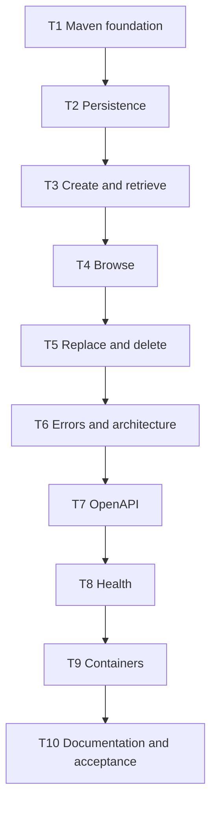

# Pricing Service Skeleton Implementation Tasks

Status: Ready for implementation.

## 1. Delivery rules

- Each task is one independently buildable, reviewable commit with the listed message.
- Every task starts from its verified predecessor and ends with `mvn -B -ntp clean verify` passing.
- The final acceptance task runs the project-mandated `mvn -B -ntp clean verify` lifecycle.
- Specification gaps are corrected in `requirements.md` or `design.md` before code changes.
- No task uses test, formatting, migration, or compilation skip flags.

## 2. Dependency graph

The intentionally linear graph keeps every task boundary executable and covered.

## 3. Implementation tasks

### T1 - Bootstrap Java and Maven

**Commit:** `build: bootstrap pricing service`

**Depends on:** None.

**Refs.** `requirements.md` AC10.4 and AC11.1; `design.md` §1.1-§1.2 and
§10.1-§10.2.

**Scope.**

- Add the Java 25 single-module Spring Boot project, `PricingApplication`, exact dependency
  baseline, and `pricing.jar` executable name.
- Configure compiler parameter metadata, Boot repackaging, Surefire, Failsafe, Enforcer, and
  Spotless with pinned Palantir formatting.
- Add Maven Wrapper 3.3.4 in script-only mode, Maven 3.9.16, and distribution checksum.
- Add only required repository/build ignores.

**DoD.**

- `pom.xml` resolves every dependency/version in `design.md` §1.1 and §10.1 on Java 25 and contains
  no H2, Spring Security, Lombok, MapStruct, or google-java-format dependency.
- `mvnw`, `mvnw.cmd`, and `.mvn/wrapper/maven-wrapper.properties` exist; the Wrapper reports Maven
  3.9.16 and has a non-empty distribution checksum.
- `mvn -B -ntp package` produces executable `target/pricing.jar` with `PricingApplication` as its
  Boot entry point.
- `mvn -B -ntp clean verify` succeeds with test discovery, Enforcer, and Spotless active and without skip
  flags.

### T2 - Establish Pricing-owned persistence

**Commit:** `feat: add pricing persistence foundation`

**Depends on:** T1.

**Refs.** `requirements.md` AC1.2, AC4.2, AC8.1-AC8.6, and AC11.2-AC11.3;
`design.md` §4.1-§4.4, §5.1-§5.2, §8.1, §8.3, §11.1-§11.2, and §12.

**Scope.**

- Add `Pricing`, `PricingRepository`, explicit schema mappings, and the immutable natural key.
- Add `V1__create_pricing_entries.sql` with all six columns and database constraints.
- Configure schema-local Flyway, validation-only Hibernate DDL, no SQL initialization, and no
  Open Session in View.
- Add the PostgreSQL 18.4 Testcontainers base and restricted test role/schema bootstrap.

**DoD.**

- `PricingTest` runs without Spring and proves assigned identity, absence of a serial mutator, and
  replacement of only the five mutable values.
- `MigrationIT` starts `postgres:18.4-alpine` with database `rentflow`, creates the restricted
  `pricing` role/schema before Spring, and proves Flyway/Hibernate connect as Pricing rather than
  the administrator.
- V1 appears once in `pricing.flyway_schema_history`, creates
  `pricing.pricing_entries`, and creates neither application nor Flyway tables in `public`.
- Direct invalid inserts prove the serial, positivity, non-negativity, threshold, and discount
  constraints; a valid row survives a second migration/application context startup.
- A sentinel table in another service schema remains untouched; missing or inaccessible Pricing
  schema startup fails before readiness.
- No schema-generation script/mode or migration creates the shared database, role, or schema.
- `mvn -B -ntp clean verify` succeeds with no-context domain tests and real-PostgreSQL migration tests.

### T3 - Deliver create and retrieve

**Commit:** `feat: create and retrieve pricing`

**Depends on:** T2.

**Refs.** `requirements.md` AC1.1-AC1.4, AC2.1-AC2.2, AC6.1-AC6.3,
AC11.2-AC11.4, and AC12.1; `design.md` §2.1-§2.3, §3.1-§3.2, §4.3-§4.4,
§5.1-§5.3, §6.1-§6.3, and §11.1-§11.2.

**Scope.**

- Add `PricingDTO`, converter, transactional service, domain exceptions, and controller mappings
  for `POST` and item `GET`.
- Add problem/violation DTOs and handler behavior needed for validation, duplicate, malformed, and
  not-found outcomes.
- Add DTO, converter, and service unit tests plus full-stack create/retrieve/conflict tests.

**DoD.**

- `PricingDTOTest`, `PricingConverterTest`, and `PricingServiceTest` use no Spring context; Mockito
  collaborators prove repository interactions and non-interaction on rejected paths.
- Valid unauthenticated `POST /api/v1/pricing` returns `201`, all six exact business values, a
  resource `Location`, and a row under the case-sensitive supplied serial.
- Item `GET` returns `200`; missing item returns `404`; invalid path syntax returns `400`; and
  `DRILL-001` and `drill-001` remain distinct.
- Missing, null, boundary-violating, over-precision, over-scale, unknown-property, wrong-type, and
  malformed create bodies return `400` and leave the table unchanged.
- Sequential and concurrent duplicates return the stable `409` for the loser, retain the original
  row, and expose no SQL or constraint detail.
- Every slice error is `application/problem+json`; validation errors carry sorted violations.
- `mvn -B -ntp clean verify` succeeds with unit and PostgreSQL full-stack tests.

### T4 - Deliver bounded pricing browsing

**Commit:** `feat: browse pricing`

**Depends on:** T3.

**Refs.** `requirements.md` AC3.1-AC3.5, AC6.2, AC11.3-AC11.4, and AC12.1;
`design.md` §2.3, §3.3, §4.3, §5.1, §6, §11.2, and §12.

**Scope.**

- Add `PricingSortField`, strict collection query-name/value validation, deterministic
  `PageRequest` construction, and collection `GET`.
- Convert entities before explicitly wrapping the result in non-HATEOAS Spring Data `PagedModel`.
- Add full-stack pagination, sort, validation, and empty-result tests.

**DoD.**

- A parameter-free request returns page zero, size 20, accurate totals, non-null `content`, nested
  `page`, and `serialNumber ASC` ordering without legacy aliases or links.
- Valid page/size combinations, empty data, and a page beyond the end return the documented shape.
- Ascending and descending sorting works for all six allowlisted fields; duplicate primary values
  prove the `serialNumber ASC` tie-breaker, while serial sorting uses its requested direction.
- Negative, zero, too-large, nonnumeric, unknown, repeated, blank, invalid-sort, and
  invalid-direction inputs each return a deterministic `400` validation problem.
- Filtering parameters are rejected rather than ignored or interpreted as broad queries.
- Requests succeed without credentials, and `mvn -B -ntp clean verify` passes against PostgreSQL.

### T5 - Deliver replace and delete

**Commit:** `feat: replace and delete pricing`

**Depends on:** T4.

**Refs.** `requirements.md` AC4.1-AC4.5, AC5.1-AC5.3, AC6.2, AC11.2-AC11.4,
and AC12.1; `design.md` §3.4-§3.5, §4.4, §5.1-§5.3, §6, §11.1-§11.2,
and §12.

**Scope.**

- Add transactional full replacement and permanent deletion to service and controller.
- Extend unit and full-stack coverage for every replacement and deletion outcome.

**DoD.**

- Unit tests prove replacement changes only the five mutable fields, deletion loads before
  removal, and every missing/rejected path is non-mutating.
- Valid `PUT` returns `200`, persists exactly the five replacement values, and preserves identity.
- A path/body mismatch, including case-only difference, returns `400` before repository mutation;
  malformed or invalid replacement preserves the entire original row.
- Replacing missing pricing returns `404` and never upserts.
- Deleting existing pricing returns bodyless `204` and makes subsequent retrieval `404`; deleting
  missing pricing returns `404`.
- Operations remain unauthenticated, failures use the existing problem contract, and
  `mvn -B -ntp clean verify` succeeds.

### T6 - Complete failures and architectural boundaries

**Commit:** `feat: standardize pricing api failures`

**Depends on:** T5.

**Refs.** `requirements.md` AC1.4, AC3.4, AC4.3-AC4.5, AC6.1-AC6.6,
AC11.2, AC11.4-AC11.5, and AC12.1-AC12.2; `design.md` §1.2-§1.3,
§2.1-§2.2, §3.6, §5.3, §6.1-§6.3, and §11.1-§11.3.

**Scope.**

- Complete the stable problem catalogue, deterministic violations, and all framework/unexpected
  error mappings.
- Add handler unit tests, full-stack error tests, and ArchUnit boundaries.
- Prove the unauthenticated boundary without adding security capabilities.

**DoD.**

- Full-stack tests cover body/path/query validation, wrong numeric types, malformed and unknown
  JSON, unsupported request/response media, unmapped paths, and unsupported methods including
  `PATCH`.
- Every error contains exact `type`, `title`, `status`, `detail`, `instance`, and `code`; only
  validation errors contain non-empty violations sorted by field/message.
- `ApiExceptionHandlerTest` proves a fixed sanitized `500` response while captured server logs
  retain method, path, exception, and full stack trace without logging a request body.
- Credential-free requests reach all operations; representative login/token/user/role/permission
  paths remain unmapped; no Spring Security dependency or application reference exists.
- `ArchitectureTest` enforces package dependencies, placement, suffixes, no cycles,
  controller-to-repository prohibition, and mapping-annotation ownership.
- `mvn -B -ntp clean verify` succeeds with unit, integration, architecture, and formatting checks.

### T7 - Publish and lock OpenAPI

**Commit:** `feat: document pricing api with openapi`

**Depends on:** T6.

**Refs.** `requirements.md` AC7.1-AC7.3, AC11.6, and AC12.2; `design.md` §6.2
and §7.1-§7.3.

**Scope.**

- Add `OpenApiConfig` plus controller/DTO schema and response annotations.
- Add `OpenApiIT` as generated-contract drift protection.

**DoD.**

- `/v3/api-docs` returns valid OpenAPI and `/swagger-ui.html` resolves without credentials;
  Actuator paths are absent.
- `OpenApiIT` proves five operations and stable IDs, exact six-field schemas, decimal/integer and
  serial constraints, paging/sort defaults and bounds, typed `PagedModel`, success/error statuses,
  examples, and absence of `PATCH` and security schemes.
- Every `$ref` resolves, pricing/problem examples conform to schemas, and changing a path, field,
  constraint, operation, or response makes the test fail.
- `mvn -B -ntp clean verify` succeeds.

### T8 - Add operational health semantics

**Commit:** `feat: expose pricing health probes`

**Depends on:** T7.

**Refs.** `requirements.md` AC8.3 and AC9.4-AC9.5; `design.md` §8.1-§8.3,
§11.2, and §12.

**Scope.**

- Configure health-only Actuator exposure, additional probe paths, hidden details, and distinct
  liveness/database-aware readiness groups.

**DoD.**

- Configuration maps `/livez` to `livenessState` only and `/readyz` to
  `readinessState` plus `db`, exposing no other Actuator endpoint and no component details.
- Flyway and JPA remain startup gates for connectivity, migration, and validation failures.
- Live outage/recovery behavior is assigned to T9's smoke test instead of duplicated by a Maven
  health integration test.
- `mvn -B -ntp clean verify` succeeds with startup-failure coverage active.

### T9 - Package and smoke-test containers

**Commit:** `build: containerize pricing service`

**Depends on:** T8.

**Refs.** `requirements.md` AC8.4 and AC9.1-AC9.7; `design.md` §8.1-§8.2,
§9.1-§9.3, §11.4, and §12.

**Scope.**

- Add multi-stage `Dockerfile`, `.dockerignore`, Compose, and executable local PostgreSQL
  role/schema bootstrap.
- Add executable `scripts/container-smoke-test.sh` implementing `design.md` §11.4.

**DoD.**

- `docker compose config` shows `pricing` and `rentflow-postgres`, PostgreSQL `18.4-alpine`, shared
  database `rentflow`, Pricing datasource variables, loopback-only database publication, and a
  persistent named volume.
- Clean image build compiles in Java 25 without skip flags; runtime has `pricing.jar` and Java 25
  JRE but no source, compiler, Maven, or Maven cache.
- Inspection proves UID/GID `10001`, `/opt/pricing/pricing.jar`, and `/readyz` container health.
- The executable bootstrap is identifier-safe, creates only the local restricted role/schema, and
  prints no password or creates no application/history tables.
- Smoke verification proves create/retrieve, application restart, database-outage readiness `503`
  with liveness `200`, recovery, stack recreation without volume deletion, and persisted retrieval.
- Both shell scripts pass `bash -n`, use bounded waits/cleanup, expose no secret, and
  `mvn -B -ntp clean verify` succeeds before acceptance.

### T10 - Document workflows and complete acceptance

**Commit:** `docs: document pricing service workflows`

**Depends on:** T9.

**Refs.** `requirements.md` AC10.1-AC10.4 and AC11.1-AC11.6; `design.md` §7.1,
§8.1-§8.2, §9.2-§9.3, §10.2-§10.3, and §11.1-§11.4.

**Scope.**

- Add the root README with exact build, run, API, schema-ownership, migration, health,
  documentation, and container workflows.
- Perform final traceability and clean lifecycle acceptance without unrelated features.

**DoD.**

- README covers every topic in `design.md` §10.3, labels local credentials development-only, and
  contains no production secret.
- Every documented command uses implemented names, ports, variables, artifacts, and paths.
- Executable examples cover create, retrieve, paginated/sorted list, replace, and delete with
  valid payloads.
- `./mvnw -B -ntp clean verify`, `mvn -B -ntp clean verify`, and final
  `mvn -B -ntp clean verify` succeed on Java 25 with no skipped suites or checks.
- The container smoke test succeeds from a clean checkout and cleans up its isolated stack after
  testing persisted-volume behavior.
- The traceability table below has no uncovered criterion and reports identify successful unit,
  integration, OpenAPI, architecture, and formatting checks.

## 4. Acceptance-criteria traceability

| Acceptance criteria | Primary task and regression-sensitive DoD |
| --- | --- |
| AC1.1-AC1.4 | T3 create, validation, duplicate, persistence, and unchanged-state assertions |
| AC2.1-AC2.2 | T3 found, invalid-identifier, and missing-pricing assertions |
| AC3.1-AC3.5 | T4 page envelope, pagination, all sorts, rejection, and empty-page matrix |
| AC4.1-AC4.5 | T5 replacement, immutability, validation, preservation, and no-upsert assertions |
| AC5.1-AC5.3 | T5 bodyless deletion, subsequent `404`, and missing-delete assertions |
| AC6.1-AC6.6 | T6 content type, stable fields, violations, framework errors, and sanitized `500` |
| AC7.1-AC7.3 | T7 live docs and generated schema/operation/example drift assertions |
| AC8.1-AC8.2 | T2 fresh/repeated PostgreSQL 18.4 migration and preservation assertions |
| AC8.3 | T2 startup-failure and T8 startup/health-gate assertions |
| AC8.4 | T2 context persistence and T9 container/stack restart persistence |
| AC8.5-AC8.6 | T2 Flyway-only, schema-local history, role isolation, and sentinel assertions |
| AC9.1-AC9.3 | T9 multi-stage build, non-root runtime, and Compose startup checks |
| AC9.4-AC9.5 | T8 probe groups and T9 healthy/outage/recovery observations |
| AC9.6-AC9.7 | T9 volume persistence and environment-only runtime configuration |
| AC10.1-AC10.3 | T10 README content and executable command/example checks |
| AC10.4 | T1 pinned Wrapper and T10 Wrapper lifecycle |
| AC11.1 | T1 configured lifecycle and T10 clean lifecycle with all suites active |
| AC11.2 | T2, T3, T5, and T6 no-context unit tests with Mockito where needed |
| AC11.3 | T2-T8 PostgreSQL Testcontainers integration suites |
| AC11.4 | T2-T6 migration, CRUD, paging/sort, validation, conflict, and not-found assertions |
| AC11.5 | T6 ArchUnit dependency, placement, naming, annotation, and cycle assertions |
| AC11.6 | T7 generated OpenAPI drift assertions |
| AC12.1-AC12.2 | T3-T6 credential-free operations and T6-T7 absence checks |

Every acceptance criterion has a task whose DoD visibly fails when the criterion regresses.
